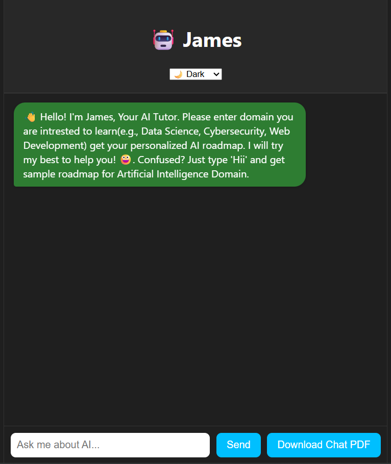

# 🤖 AI Roadmap Chatbot


An AI-powered chatbot web application that helps users explore personalized learning paths in Artificial Intelligence. Built with Python (Flask) and integrated with the Groq API, it features a dynamic, animated UI with dark/light mode and the ability to download chats as PDFs.

---

## 🚀 Features

- 🔗 Groq API integration for intelligent conversation
- 🌓 Dark & Light mode toggle
- 🎨 Animated avatar and smooth UI transitions
- 📚 Domain-based AI roadmap generation
- 📝 Download chat history as a PDF
- 🌐 Fully responsive design for mobile and desktop
- ☁️ Free hosting on Render

---

## 📁 Project Structure

```

├── app.py                  # Flask backend logic
├── requirements.txt        # Python dependencies
├── templates/
│   └── index.html          # Main HTML page (served by Flask)
├── static/
│   ├── css/                # Stylesheets
│   └── js/                 # JavaScript functionality
└── README.md               # Project documentation

````

---

## 🛠️ Installation

### 1. Clone the Repository
```bash
git clone https://github.com/yourusername/ai-roadmap-chatbot.git
cd ai-roadmap-chatbot
````

### 2. Install Dependencies

```bash
pip install -r requirements.txt
```

### 3. Set Environment Variable

**On Linux/macOS:**

```bash
export GROQ_API_KEY="your_api_key_here"
```

**On Windows (PowerShell):**

```powershell
setx GROQ_API_KEY "your_api_key_here"
```

### 4. Run the Flask App

```bash
python app.py
```

### 5. Access the App

Open your browser and navigate to:

```
http://localhost:10000
```

(or the port set in `app.py`)

---

## ☁️ Deployment on Render

This project is configured for free hosting on [Render](https://render.com).

### Render Settings:

| Setting              | Value                             |
| -------------------- | --------------------------------- |
| Build Command        | `pip install -r requirements.txt` |
| Start Command        | `python app.py`                   |
| Environment Variable | `GROQ_API_KEY` (your API key)     |

> Make sure your app binds to `0.0.0.0` and uses the `PORT` from `os.environ`.

---

## 💡 Usage

1. Visit the live app.
2. You'll receive an automatic welcome message.
3. Enter your AI domain of interest (e.g., Machine Learning, NLP, CV).
4. Get a roadmap tailored to your interest.
5. Optionally download your conversation as a PDF.

---

## 📸 Screenshots

### 🏠 Homepage


---

## 🤝 Contributing

Contributions are welcome!
Please fork the repository and open a pull request with improvements, bug fixes, or new features.

---

## 📄 License

This project is licensed under the [MIT License](LICENSE).

---

## 📬 Contact

**Naidu Rapeta**
Founder of [Hack Culprit](https://hackculprit.live)
📧 Email: [rapetanaidu478@gmail.com](mailto:rapetanaidu478@gmail.com)
🌐 Live Project: [https://your-chatbot.onrender.com](https://james-epns.onrender.com)

---

## ☕ Support

If you like this project, consider supporting me:

[](https://www.buymeacoffee.com/naidu2342)

